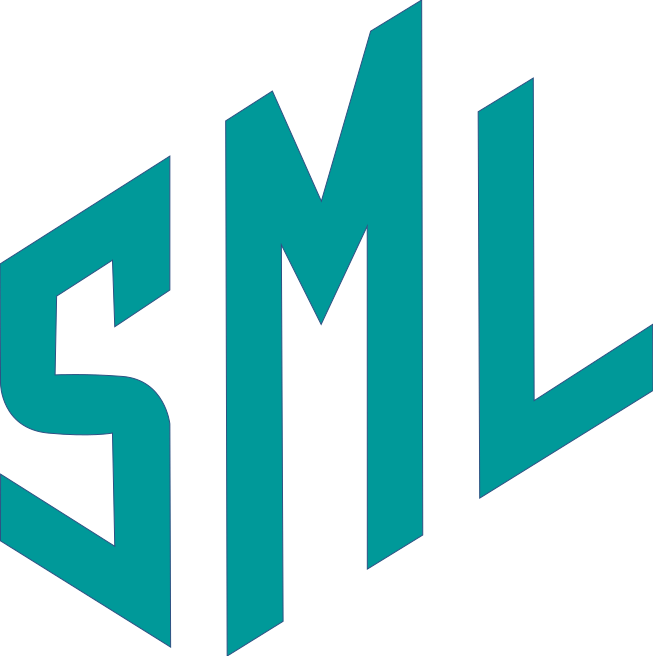

# Simple Math Library



Simple Math Library (*SML*) is a row-ordered math library For computer graphics(CG) applications.
It is platform independent and does not require any additional dependencies.
It should work with any C++ compiler but it is recommended that you use ```MSVC``` 

<br></br>
## Documentation
Check out the documentation for using the library here:

## Latest Releases
You can get the latest version of the library here:

## Support
You can reach out to me at salamivictor15@gmail.com

#### Notes
This library is currently being rewritten so it might be a bit unstable
